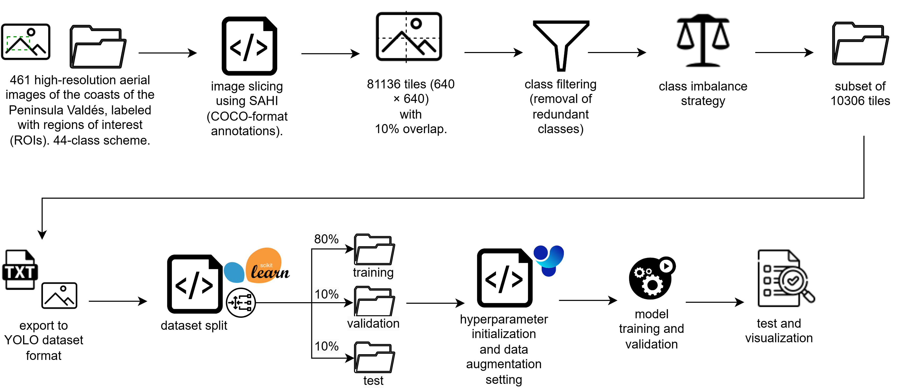
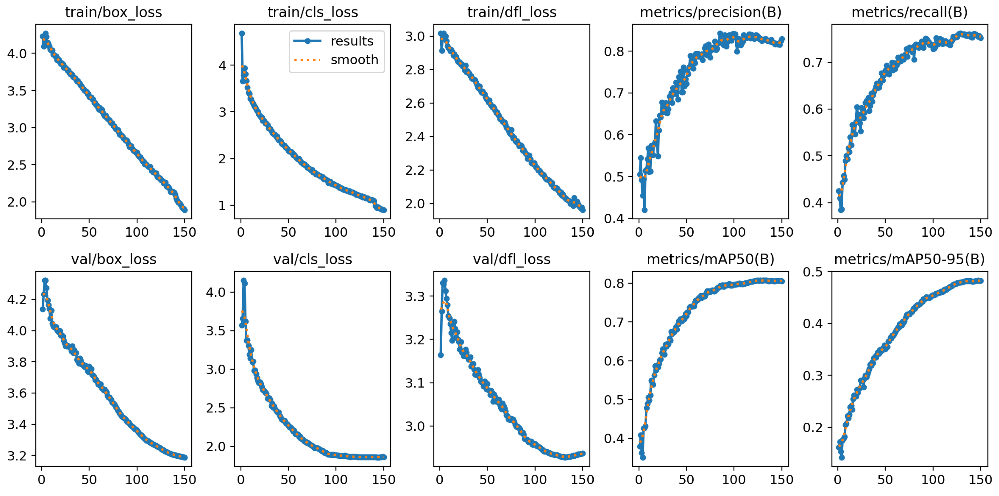
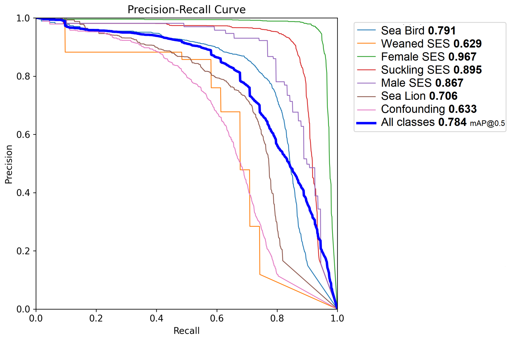

# Aerial Wildlife Detection using YOLO

Object detection pipeline for wildlife monitoring in aerial imagery using YOLO-based deep learning model.

## 📖 Overview
This repo focuses on the computer vision workflow: data preparation, model training configuration, inference, evaluation, and visualization. While remaining independent of proprietary datasets and trained models.
The implementation addresses common challenges in detection tasks, including:

 - Detection of small and densely packed objects.
 - High-resolution imagery.
 - Complex backgrounds.
 - Class imbalance across wildlife species.

## 🧠 Complete Workflow

  

## 🛠️ Tech Stack & Libraries

Core technologies used in this project:

-   **Python**  
-   **SAHI (Slicing Aided Hyper Inference)**
-   **Ultralytics YOLO (v8 / v10)**
-   **NumPy**
-   **Scikit-learn**
-   **Weight & Biases**

## 📈 Results & Metrics

The trained model based on YOLOv10X pretrained model achieved strong performance on aerial wildlife detection tasks, particularly for small-object localization in high-resolution imagery.

### Training Performance

  

### Evaluation Metrics

| Metric    | Value |
| --------- | ----- |
| mAP@50    | 0.79  |
| Precision | 0.81  |
| Recall    | 0.78  |
| F1-Score  | 0.79  |

#### Precision Recall Curve

  

