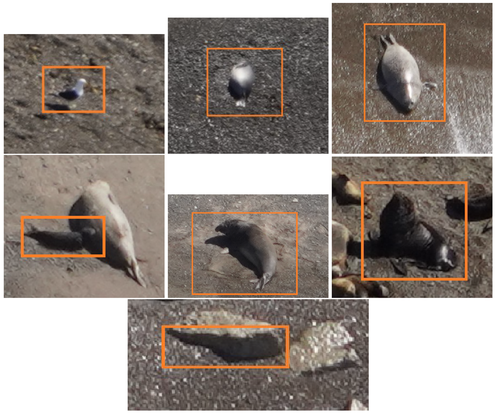
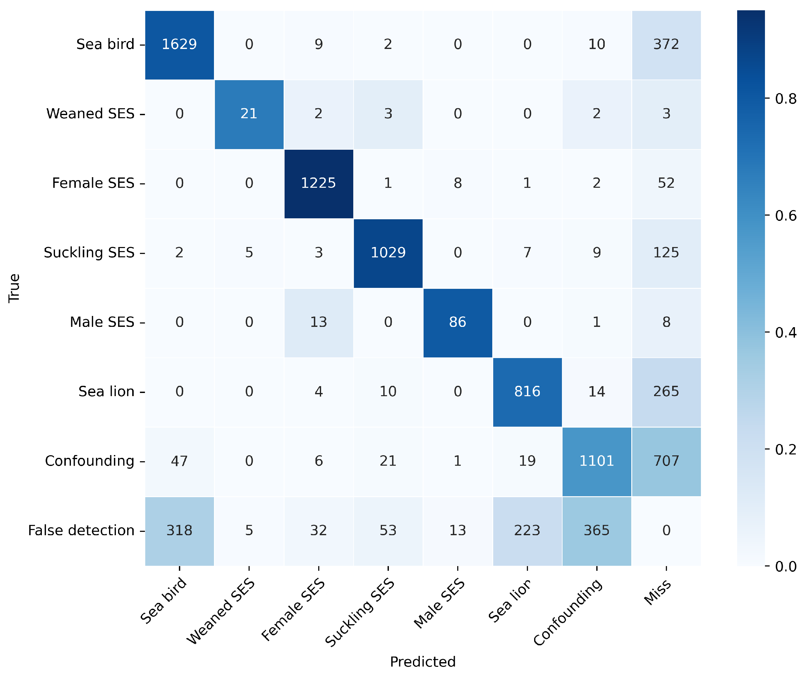

# Elephant Seal Detection using YOLO

Elephant Seal monitoring in aerial imagery using YOLO-based deep learning model.

  

## Overview & Motivation

This repo presents a deep learning-based solution for the automated detection and classification of marine-coastal wildlife using high-resolution aerial imagery captured by aircraft. The project focuses on monitoring colonies of southern elephant seals (Mirounga leonina) in the Valdés Peninsula, Patagonia, Argentina.

Traditional in situ population surveys in large and remote coastal environments are often limited by logistical and operational constraints. To address these challenges, this work combines aerial remote sensing and computer vision techniques to improve the efficiency, scalability, and accuracy of wildlife monitoring efforts.

Note: This project explores the computer vision workflow: data preparation, model training configuration, inference, evaluation, and visualization. While remaining independent of proprietary datasets and trained models.
The implementation addresses common challenges in detection tasks, including:

 - Detection of small and densely packed objects.
 - High-resolution imagery.
 - Complex backgrounds.
 - Class imbalance across coastal marine wildlife species.

## Related Publication

This repository is based on the following work:

Ascagorta, Octavio et al.,  
"Large-Scale Coastal Marine Wildlife Monitoring with Aerial Imagery",  
Journal of Imaging, 2025.

https://doi.org/10.3390/jimaging11040094

## Complete Workflow

  

## Stack & Libraries

Core technologies used in this project:

-   **Python**  
-   **SAHI (Slicing Aided Hyper Inference)**
-   **Ultralytics YOLO (v8 / v10)**
-   **NumPy**
-   **Scikit-learn**
-   **Weight & Biases**

## Results & Metrics

The trained model based on YOLOv10X pretrained model achieved strong performance on Elephant Seal detection tasks, particularly for small-object localization in high-resolution imagery.

### Training Performance

  

### Evaluation Metrics

| Metric    | Value |
| --------- | ----- |
| mAP@50    | 0.79  |
| Precision | 0.81  |
| Recall    | 0.78  |
| F1-Score  | 0.79  |

#### Precision Recall Curve

  

### Confusion Matrix

  

